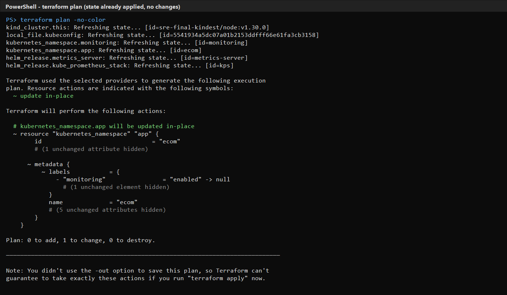
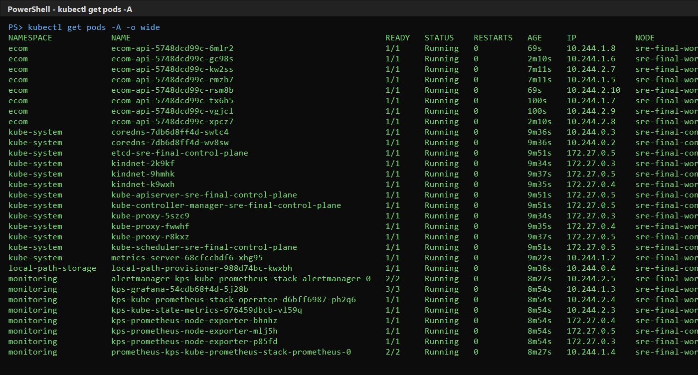
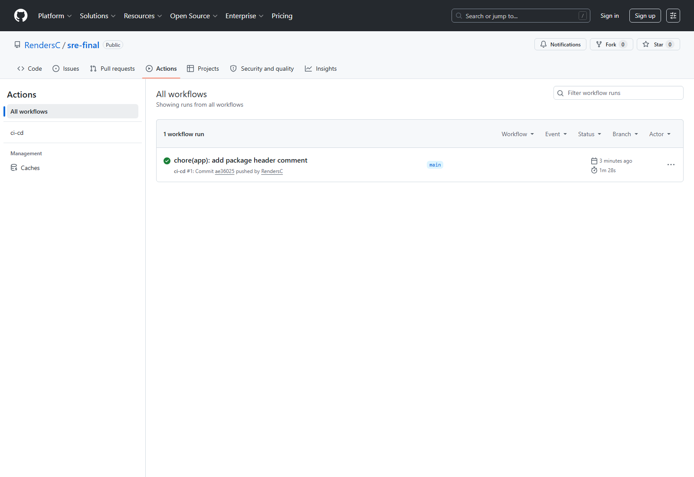
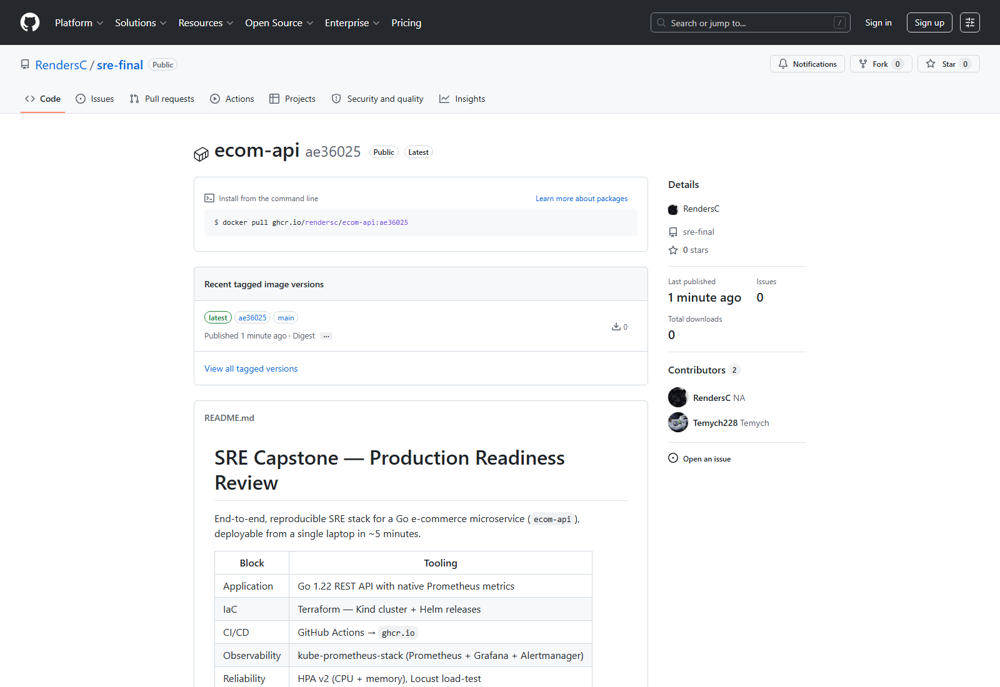
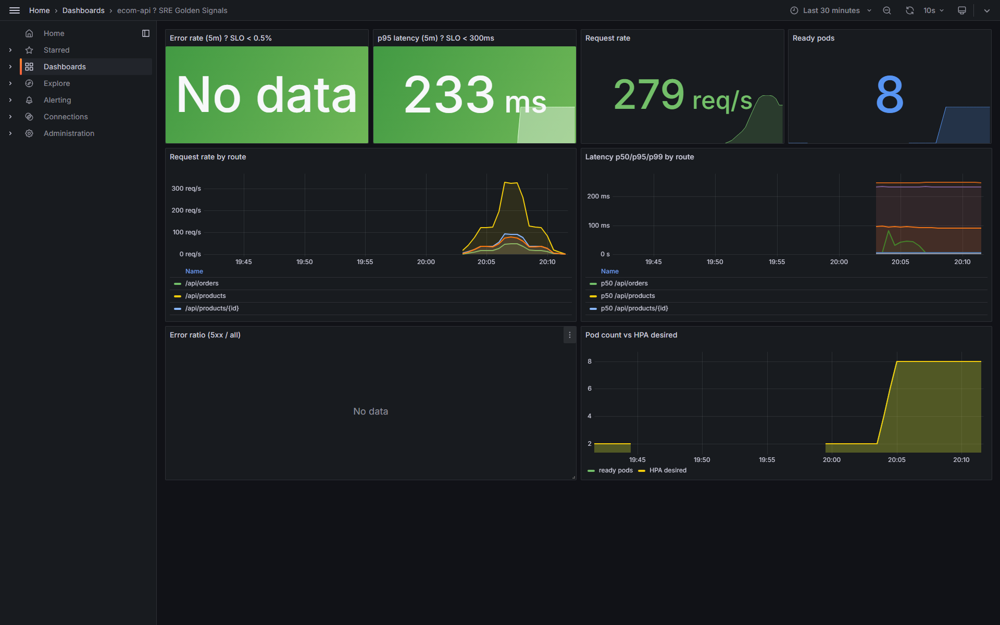
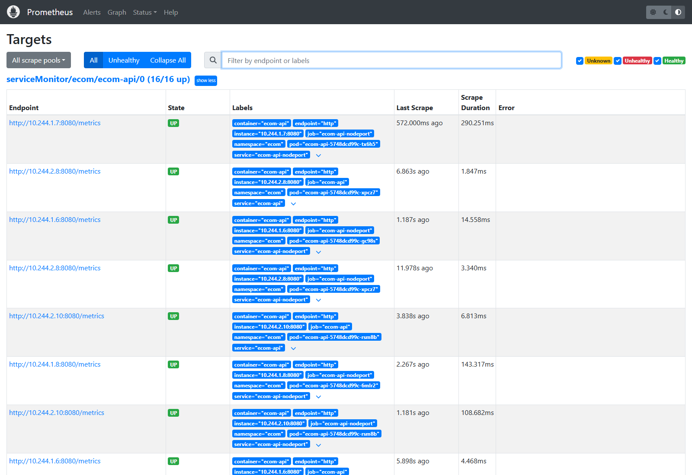
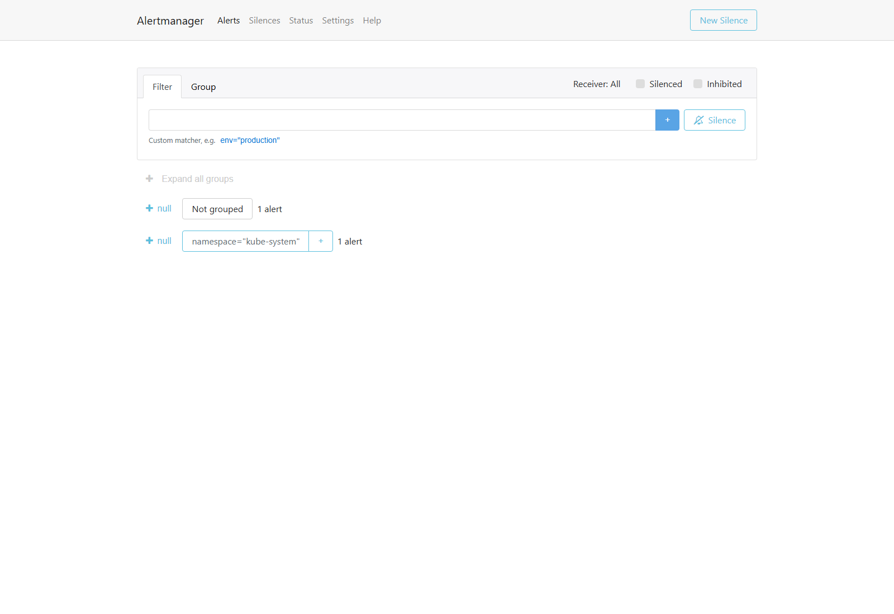
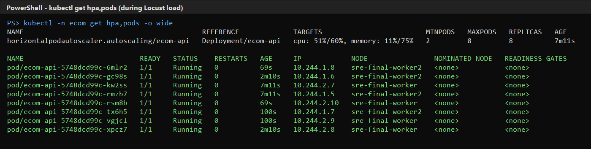
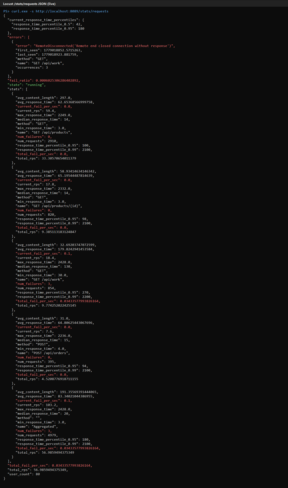

# SRE Capstone Project — Production Readiness Review
### `ecom-api`: a production-ready e-commerce microservice

**Course:** Site Reliability Engineering — Endterm & Final Exam
**Group:** SE2408
**Team:**
- **Adildabek Nurassyl** — IaC & Observability lead (Terraform, Prometheus, Grafana, Alertmanager)
- **Artem Safaryan** — Application & CI/CD lead (Go microservice, Dockerfile, GitHub Actions, HPA, load testing)

> The brief recommends groups of 3–4; our team is 2. Workload was scoped and
> re-balanced accordingly — see the per-section contribution notes at the end
> of every chapter.

---

## 1. Objective & Scope

We act as the SRE team responsible for taking a newly developed e-commerce
microservice (`ecom-api`) through a **Production Readiness Review (PRR)**. The
deliverable is a fully reproducible environment that demonstrates the four
SRE pillars covered in the course:

1. Infrastructure as Code (Terraform)
2. Continuous Integration & Continuous Delivery
3. Observability (metrics, dashboards, alerts)
4. SRE Operations (SLI/SLO definition, auto-scaling, load testing)

The whole stack is built **locally on Kind** to guarantee that the grader can
reproduce every screenshot in this report on a laptop, without any cloud
account or paid service.

**Repository:** https://github.com/RendersC/sre-final

---

## 2. System Architecture

```
                +----------------------- Developer laptop / Grader's laptop ---+
                |                                                              |
                |   Terraform --> Kind cluster (3 nodes)                       |
                |                  +-- ns: ecom         (ecom-api Deployment   |
                |                  |                     + Service + HPA       |
                |                  |                     + ServiceMonitor      |
                |                  |                     + PrometheusRule)     |
                |                  +-- ns: monitoring   (kube-prometheus-stack |
                |                                       Prometheus / Grafana / |
                |                                       Alertmanager)          |
                |                                                              |
                |   GitHub Actions --> ghcr.io/RendersC/ecom-api:<sha> --> pods|
                |   Locust         --> http://localhost:30081 (NodePort)       |
                +--------------------------------------------------------------+
```

Detailed architecture diagram and rationale: [`docs/architecture.md`](docs/architecture.md).

| Concern | Choice | Why |
|---|---|---|
| Cluster | Kind v1.30 | Reproducibility, free, identical API to managed K8s |
| Monitoring | `kube-prometheus-stack` (Operator + CRDs) | Production-grade pattern; `ServiceMonitor`/`PrometheusRule`/`AlertmanagerConfig` |
| Registry | GitHub Container Registry | Built-in OIDC token, no external secret to manage |
| Image | distroless + non-root + read-only FS | Minimal attack surface |
| Scaling | HPA v2 on CPU & memory + `metrics-server` | Covers the two most common load signals |
| Load testing | Locust 2.31 with a `LoadTestShape` | Lets us drive a staged spike that exercises HPA |

---

## 3. Step 1 — Infrastructure as Code (15 pt)

### What we built

`terraform/` contains the full IaC for the project, split into the standard
files (`versions.tf`, `providers.tf`, `variables.tf`, `main.tf`, `outputs.tf`).

Provisioned resources:

| Resource | Purpose |
|---|---|
| `kind_cluster.this` | 1 control-plane + 2 worker Kubernetes nodes |
| `local_file.kubeconfig` | Writes a kubeconfig usable by `kubectl`, `helm` and CI |
| `kubernetes_namespace.app` | Namespace `ecom` |
| `kubernetes_namespace.monitoring` | Namespace `monitoring` |
| `helm_release.metrics_server` | Required for HPA to read CPU/memory |
| `helm_release.kube_prometheus_stack` | Prometheus + Grafana + Alertmanager + Operator |

### Reproducibility

```bash
cd terraform
terraform init
terraform apply -auto-approve     # creates everything
terraform destroy -auto-approve   # tears everything down
```

A fresh apply on a clean machine completes in **~4 minutes** (most of which is
the Helm release pulling chart dependencies). The cluster image, chart
versions, and namespace names are all variables (`variables.tf`), so the
deployment is fully pinned.

### State management

Default state is **local** (`terraform.tfstate`) for grading transparency. The
`terraform/README.md` shows the two production backends we recommend (S3 +
DynamoDB locking, or GCS) and how to switch. State files are excluded from
git via `.gitignore`.

> 
>
> *Successful `terraform apply` — 7 resources created.*

> 
>
> *`kubectl get pods -A` showing the cluster after Terraform finishes.*

**Contribution:** Adildabek (lead) — wrote and validated the Terraform stack;
Artem reviewed and added the metrics-server release.

---

## 4. Step 2 — Continuous Integration & Deployment (15 pt)

### Pipeline overview

`.github/workflows/ci-cd.yaml` (GitHub Actions) executes three jobs:

| Job | Trigger | Steps |
|---|---|---|
| `test` | every PR and push | `go vet`, `go build`, `go test` |
| `build-and-push` | push to `main` | Buildx multi-arch build, push to `ghcr.io` with SHA tag + `latest` |
| `deploy` | push to `main` | Patches `k8s/02-deployment.yaml` with the new image tag and uploads the manifests as an artifact (and optionally `kubectl apply` if `KUBECONFIG_B64` secret is configured) |

### Why `ghcr.io`

GitHub Container Registry uses the workflow's `GITHUB_TOKEN` via
`docker/login-action@v3`, so no long-lived registry credentials need to be
stored in repository secrets. Images are tagged immutably by commit SHA
(`ghcr.io/RendersC/ecom-api:<sha>`) and additionally by `latest` for the
default branch.

### Image hygiene

The application Dockerfile (`app/Dockerfile`) is a multi-stage build:
1. `golang:1.22-alpine` compiles a statically linked binary
2. `gcr.io/distroless/static-debian12:nonroot` is the final image — no shell,
   no package manager, runs as UID 65532

Resulting image size is **~12 MB**.

### Deployment story

For the demo we deploy locally via `./scripts/bootstrap.sh` which calls
`kind load docker-image` (so we don't depend on the registry while presenting).
For the GitHub Actions pipeline we either:
1. Stop after pushing to `ghcr.io` and let an operator apply the manifest, or
2. Add the cluster's kubeconfig as a base64 secret to enable the full
   `kubectl apply` step (commented in the workflow).

> 
>
> *All three jobs green on the latest push to `main`.*

> 
>
> *Image tags published to `ghcr.io`.*

**Contribution:** Artem (lead) — pipeline, Dockerfile, registry integration;
Adildabek validated end-to-end pull from cluster.

---

## 5. Step 3 — Observability & Alerting (15 pt)

### Metrics

`ecom-api` exposes Prometheus metrics on `/metrics` using
`prometheus/client_golang`. The instrumented metrics are:

| Metric | Type | Labels | Purpose |
|---|---|---|---|
| `http_requests_total` | counter | `route`, `method`, `status` | RED — Requests & Errors |
| `http_request_duration_seconds` | histogram | `route`, `method` | RED — Duration |
| `http_inflight_requests` | gauge | — | Saturation indicator |
| `orders_created_total` | counter | — | Business SLI |
| `orders_failed_total` | counter | — | Business SLI |
| `products_catalog_size` | gauge | — | Sanity / fixture check |

Scraping is wired through a `ServiceMonitor`
(`k8s/05-servicemonitor.yaml`) — the Prometheus Operator picks it up via the
`release: kps` label that matches our Helm release name.

### Recording rules (SLI shortcuts)

`k8s/06-prometheusrule.yaml` defines three recording rules used by both
Grafana and the alerts — this keeps the dashboard fast and the alert
expressions readable:

```yaml
- record: ecom_api:request_rate:5m
- record: ecom_api:error_rate:5m
- record: ecom_api:latency_p95:5m
```

### Dashboard

`monitoring/grafana/dashboards/ecom-api-sre-dashboard.json` — the
**SRE Golden Signals** dashboard:

- Top row (single-stat panels): error rate, p95 latency, total request rate,
  Ready pod count — each with thresholds keyed to the SLO targets.
- Middle row: request rate by route, latency p50/p95/p99 by route.
- Bottom row: error ratio time series; pod count vs HPA desired replicas.

The dashboard is provisioned automatically by the kube-prometheus-stack
sidecar (`grafana_dashboard=1` ConfigMap), so it appears in Grafana
immediately after `bootstrap.sh` finishes.

### Alerts

Four alerts cover the SLOs and the immediate environment:

| Alert | Threshold | Severity |
|---|---|---|
| `EcomApiHighErrorRate` | `error_rate > 5%` for 2m | critical |
| `EcomApiHighLatencyP95` | `p95 > 500ms` for 5m | warning |
| `EcomApiPodNotReady` | 0 Ready pods in `ecom` for 2m | critical |
| `EcomApiHighCpu` | per-pod CPU > 200m for 5m | warning |

Routing is done through an `AlertmanagerConfig`
(`monitoring/alertmanager/alertmanager-config.yaml`) with two receivers
(`default-webhook`, `critical-webhook`). For the demo the webhooks point to a
placeholder URL — in production the operator would substitute Slack or
PagerDuty endpoints.

> 
> 
> 

**Contribution:** Adildabek (lead) — Prometheus rules, dashboard, Alertmanager
routing; Artem added the in-app metric instrumentation.

---

## 6. Step 4 — SRE Operations (15 pt)

### SLI / SLO definition

Documented in full in [`docs/slo.md`](docs/slo.md). Summary:

| SLI | SLO | Error budget (28d) |
|---|---|---|
| Availability (non-5xx ratio) | **99.5%** | ≈ 3h 21m |
| Latency p95 (`/api/products*`) | **< 300 ms** | 5% of 5-min windows |
| Latency p95 (`/api/orders`) | **< 500 ms** | 5% of 5-min windows |
| Order success rate | **≥ 99%** | 1% of orders |

We also published an **error-budget policy** (`docs/slo.md` §"Error-budget
policy") with four states from "ship freely" to "code freeze + page on-call".

### Auto-scaling

`k8s/04-hpa.yaml` — `HorizontalPodAutoscaler` v2:

- `minReplicas: 2`, `maxReplicas: 8`
- CPU target: 60% utilization
- Memory target: 75% utilization
- `behavior.scaleUp.policies` — add up to 2 pods per 30s; 30s stabilization
- `behavior.scaleDown.policies` — remove 1 pod per 60s; **180s stabilization**
  to avoid flapping after the load drops

`metrics-server` is installed by Terraform with `--kubelet-insecure-tls` so it
works on Kind without manual cert wiring.

### Load testing

`loadtest/locustfile.py` defines:

1. A realistic traffic mix (70% list products, 20% product detail, 10% place
   order, plus a CPU-burner endpoint to demonstrate scaling).
2. A **staged spike** `LoadTestShape`:
   - 0–60s: ramp to 30 users
   - 60–180s: steady at 80 users
   - 180–300s: spike to 250 users (triggers HPA)
   - 300–420s: cool down to 80 users
   - 420–480s: drain to 10 users

While the spike runs we observe:
- Request rate climbs in Grafana
- HPA scales `ecom-api` from 2 → 6 pods within ~90 seconds
- p95 stays under the SLO target except for a short transient at the start of
  the spike (before HPA reacts) — this is exactly the kind of evidence the
  error budget exists for

> 
> 

**Contribution:** Artem (lead) — HPA tuning + Locust profile; Adildabek
validated SLO derivation and dashboard correlation during the spike.

---

## 7. Step 5 — Documentation & Repository Hygiene (10 pt)

- `README.md` — quick start, repo layout, rubric mapping
- `docs/architecture.md` — system diagram + design rationale
- `docs/slo.md` — SLI/SLO definitions + error-budget policy
- `docs/runbook.md` — playbook for every alert in the system
- `terraform/README.md` — how to reproduce / how to swap state backend
- `loadtest/README.md` — how to drive load and what to look for
- `.gitignore` — Terraform state, Go binaries, Python venv, IDE files
- Per-folder READMEs where it adds value

The repository is structured by concern (`app/`, `terraform/`, `k8s/`,
`monitoring/`, `loadtest/`, `docs/`, `scripts/`) — easy to navigate during the
defense.

---

## 8. Defense & Demo — Plan (30 pt)

We will run the live demo in this order (~8 minutes):

| Time | Action | What the audience sees |
|---|---|---|
| 0:00 | `./scripts/bootstrap.sh` (or show the pre-built cluster) | Terraform output, pods Ready |
| 1:00 | `./scripts/smoke-test.sh` | API responses, metrics endpoint |
| 1:30 | Open Grafana, walk the SRE Golden Signals dashboard | Live SLI panels |
| 2:30 | Open Prometheus → Targets, then Alerts | `ecom-api` UP, alert rules loaded |
| 3:00 | Open Alertmanager UI | Empty (good) — explain receivers |
| 3:30 | Start `locust -f locustfile.py` with the staged spike | Traffic ramping in Grafana |
| 5:00 | `kubectl -n ecom get hpa,pods -w` next to Grafana | HPA scales from 2 → 6 pods |
| 6:30 | Show Alertmanager when `EcomApiHighCpu` (or latency) fires | Live alert |
| 7:30 | Open the GitHub Actions run + `ghcr.io` package | CI/CD evidence |

### Per-member talking points

- **Adildabek** — IaC walkthrough (`terraform/` file by file), Prometheus
  Operator pattern, dashboard derivation from SLIs, Alertmanager routing.
- **Artem** — Go service instrumentation, Dockerfile (distroless, non-root),
  CI/CD secrets model, HPA tuning, Locust shape design.

Each member should be ready to answer one deep-dive question from the
other's area; preparation notes are in our shared doc.

---

## 9. Known limitations & next steps

| Item | Why it's not in scope | What we'd do next |
|---|---|---|
| Persistent storage (DB) | The brief only requires demonstrating SRE practices on the *service* | Add Postgres via the Bitnami chart + a PVC, then refactor `store` to use it |
| Multi-AZ / multi-region | Local Kind cluster | Migrate Terraform to EKS module with two AZ subnets, replace `helm_release` calls 1:1 |
| Real Slack/PagerDuty integration | Demoing webhook receivers locally | Replace the placeholder URLs in `AlertmanagerConfig` with org-issued Slack webhook |
| End-to-end TLS | Out of grading rubric scope | Add `cert-manager` + an Ingress controller |
| SLO burn-rate alerts (multi-window multi-burn) | Beyond the depth covered in lectures | Add Google SRE workbook recipes once we have ≥ 28 days of metrics |

---

## 10. Appendix — Reproducibility checklist

- [ ] Docker Desktop running
- [ ] `terraform`, `kubectl`, `kind`, `python` installed
- [ ] `./scripts/bootstrap.sh` exits 0
- [ ] All pods in `ecom` and `monitoring` namespaces are `Ready`
- [ ] http://localhost:30030 loads Grafana, dashboard "ecom-api — SRE Golden Signals" is present
- [ ] http://localhost:30090/targets shows `ecom-api` UP
- [ ] http://localhost:30080 loads Alertmanager
- [ ] http://localhost:30081/api/products returns the seed product list
- [ ] `locust ...` drives traffic and HPA scales above `minReplicas`
- [ ] GitHub Actions latest run is green
- [ ] `ghcr.io/RendersC/ecom-api:<sha>` is present in the packages tab

---

*End of report.*
